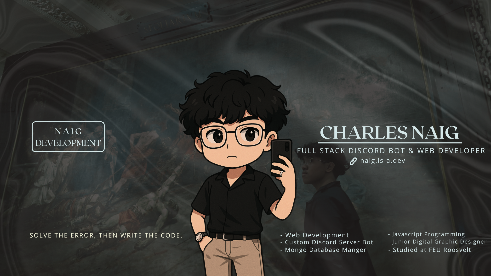
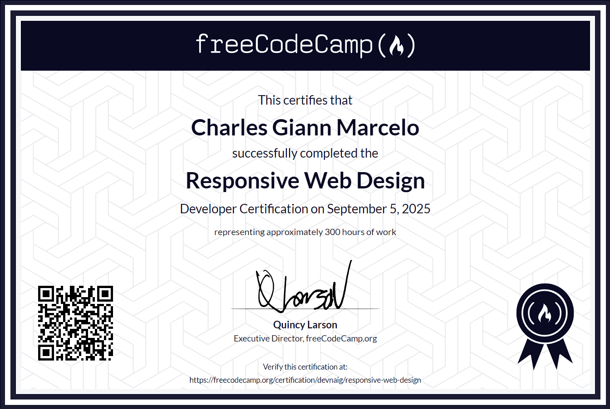
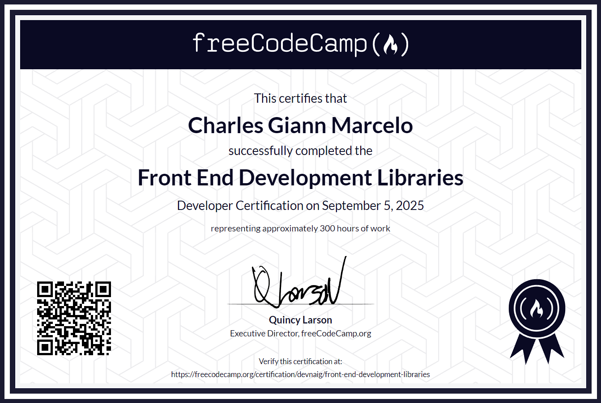
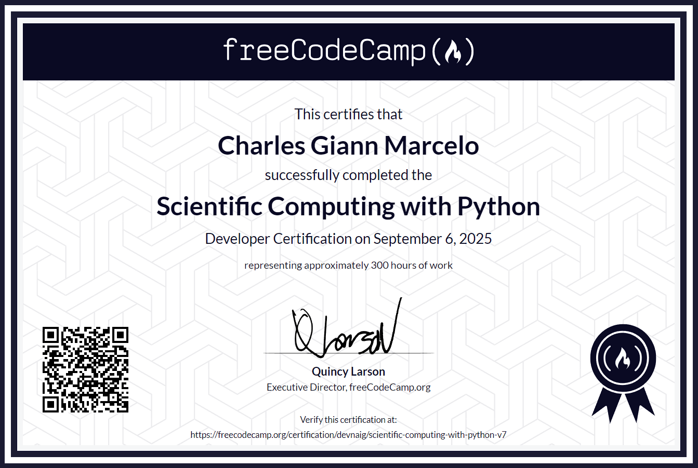
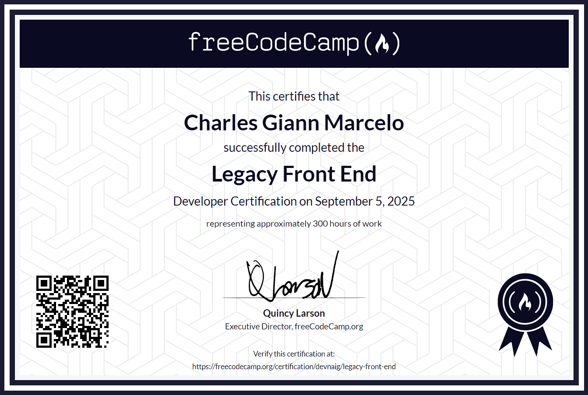
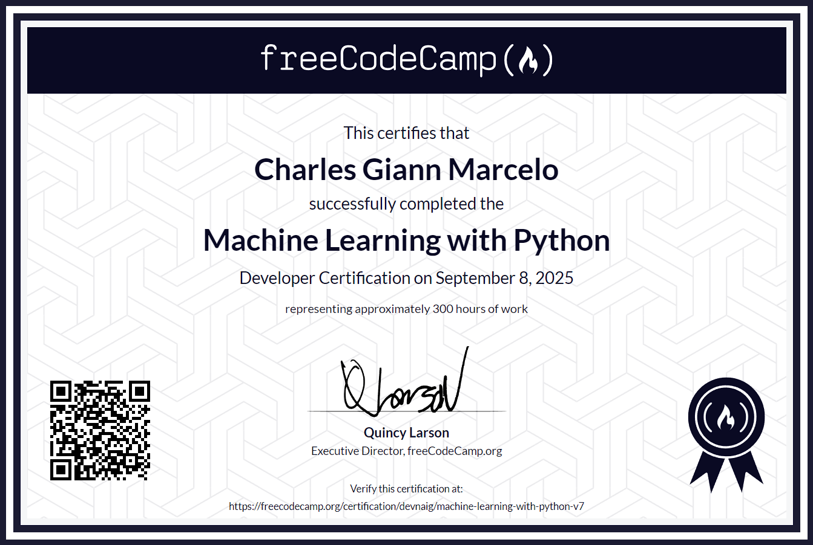
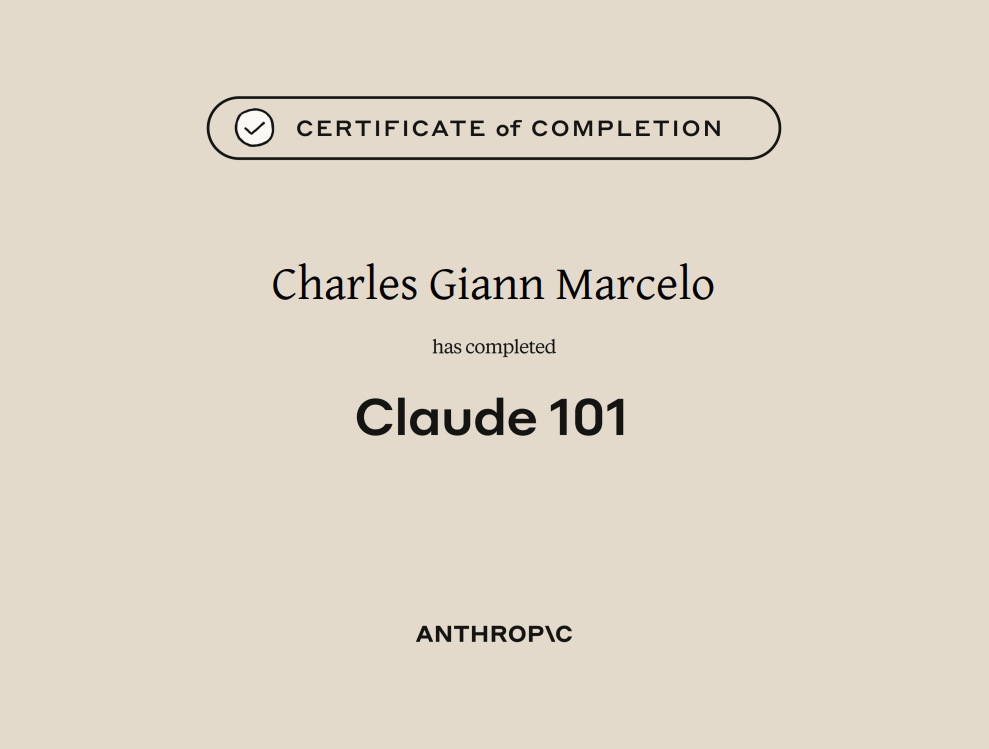
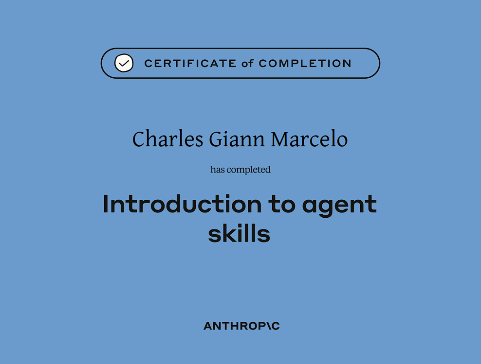
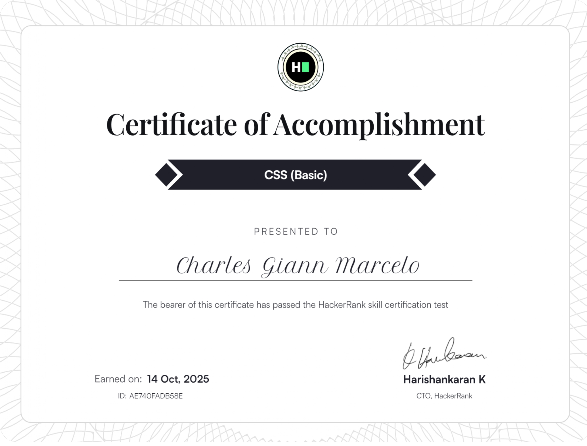

<h1 align="center"> Hi, I'm Charles Marcelo (hatry4/Naig)</h1>
<h3 align="center"> Full-Stack Discord Bot & Web Developer |  Gamer |  FEU Student from the Philippines</h3>

  
  

 

##  About Me

Hey there! I'm Charles, a passionate **17-year-old developer** from the Philippines who loves creating digital experiences. Born on December 29, 2007, I've been on an exciting journey learning web development and design.

-  Currently mastering **Full-Stack Development** (Front-End & Back-End)
-  **Accepting freelance projects** starting at **<a href=""> $40-200 </a>**
-  Goal: Building innovative web solutions that make a difference
-  When I'm not coding, you'll find me gaming or exploring new technologies or either chatting with my friends.
-  Reach out: **cm122927@gmail.com**

  

##  Certifications & Achievements

  <table>
    <tr>
      <td align="center" width="250">
         
        <strong>Best in Computer System Servicing</strong> 
        <i>FEU Roosevelt (FEUR)</i>
      </td>
      <td align="center" width="250">
         
        <strong>Responsive Web Design</strong> 
        <i>freeCodeCamp</i>
      </td>
      <td align="center" width="250">
         
        <strong>JavaScript Algorithms and Data Structures</strong> 
        <i>freeCodeCamp</i>
      </td>
    </tr>
    <tr>
      <td align="center" width="250">
         
        <strong>Front End Development Libraries</strong> 
        <i>freeCodeCamp</i>
      </td>
      <td align="center" width="250">
         
        <strong>Scientific Computing with Python</strong> 
        <i>freeCodeCamp</i>
      </td>
      <td align="center" width="250">
         
        <strong>Legacy Front End</strong> 
        <i>freeCodeCamp</i>
      </td>
    </tr>
    <tr>
      <td align="center" width="250">
         
        <strong>Machine Learning With Python</strong> 
        <i>freeCodeCamp</i>
      </td>
      <td align="center" width="250">
         
        <strong>Introduction to CSS</strong> 
        <i>Simplilearn | SkillUp</i>
      </td>
      <td align="center" width="250">
         
        <strong>Introduction to HTML</strong> 
        <i>Simplilearn | SkillUp</i>
      </td>
    </tr>
    <tr>
      <td align="center" width="250">
         
        <strong>Full-Stack Development 101</strong> 
        <i>Simplilearn | SkillUp</i>
      </td>
      <td align="center" width="250">
         
        <strong>Introduction To Front End Development</strong> 
        <i>Simplilearn | SkillUp</i>
      </td>
      <td align="center" width="250">
         
        <strong>Front End Developer React</strong> 
        <i>HackerRank</i>
      </td>
    </tr>
    <tr>
      <td align="center" width="250">
         
        <strong>Claude 101</strong> 
        <i>Anthropic</i>
      </td>
      <td align="center" width="250">
         
        <strong>Introduction to Agent Skills</strong> 
        <i>Anthropic</i>
      </td>
      <td align="center" width="250">
         
        <strong>AI Agents and Agentic AI with Python &amp; Generative AI</strong> 
        <i>Vanderbilt University | Coursera</i>
      </td>
    </tr>
    <tr>
      <td align="center" width="250">
         
        <strong>1st Place — CTF Freshmen Challenge</strong> 
        <i>FEU Institute of Technology</i>
      </td>
      <td align="center" width="250">
         
        <strong>CSS (Basic)</strong> 
        <i>HackerRank</i>
      </td>
      <td align="center" width="250">
         
        <strong>Python (Basic)</strong> 
        <i>HackerRank</i>
      </td>
    </tr>
    <tr>
      <td align="center" width="250">
         
        <strong>Node.js (Intermediate)</strong> 
        <i>HackerRank</i>
      </td>
      <td align="center" width="250">
         
        <strong>JavaScript (Intermediate)</strong> 
        <i>HackerRank</i>
      </td>
      <td align="center" width="250">
         
        <strong>Agents and Work Flows (Open AI)</strong> 
        <i>HackerRank</i>
      </td>
    </tr>
  </table>

  ##  Tech Stack

   <h3>
   Languages</h3>
    
    
    
    
    
    
    
    

     

  <h3>
   Frameworks & Libraries</h3>
    
    
    
    
    
    
    

    

   <h3>
   Database & Storage</h3>
    
    
    

    

  <h3>
   Cloud & Hosting</h3>
    
    
    
    
    
    

    

  <h3>
   Tools & Development</h3>
    
    
    
    
    
    
      

  <h3>
   IDEs & Editors</h3>
    
    
    

    

  <h3>
   Server Management</h3>
    
    
    
    
    

    

   <h3>
   Design & Creative</h3>
    
    
    

##  GitHub Analytics

  
  

  

##  Let's Connect!

##  Support My Work

If you like what I do and want to support my journey, consider buying me a coffee! 

)

---

  <i> "Code is like humor. When you have to explain it, it's bad." - Cory House</i>

  <i> "Solve the error, Then Write the code" - Naig</i>

   If you find my work interesting, don't forget to star my repositories!

<!-- Crafted with ❤️ by hatry4 -->
